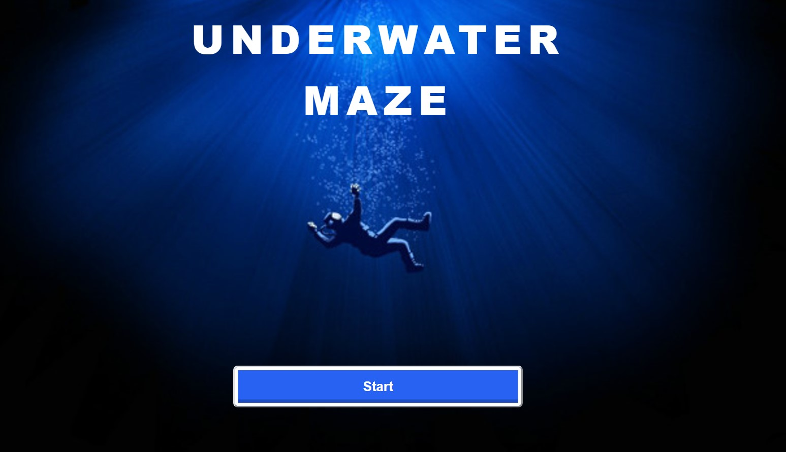
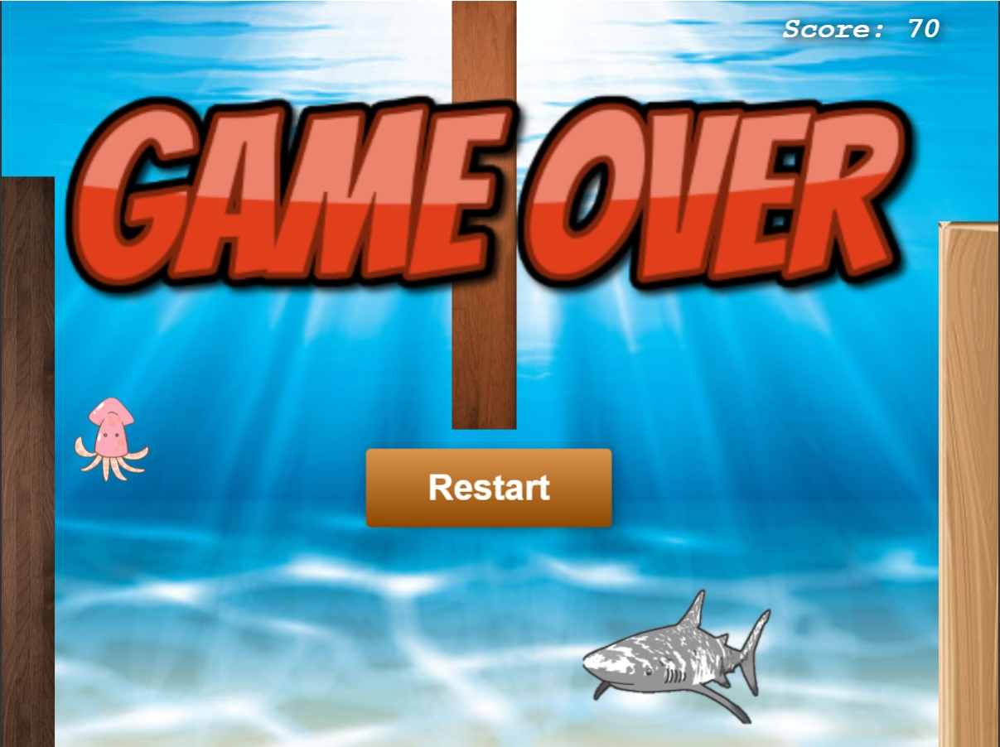

# [Underwater Maze](https://sehyunnoh.github.io/UnderwaterMaze/)
## 1. Index Page
> - This is a web game made using zim.js.

## 2. Main Page
> - It can be operated through the keyboard and avoid sharks and obstacles.
> - Added sound to all actions and marks scores in the upper right corner

## Technologies
> Zim.js, HTML5, CSS3, JavaScript, ES6